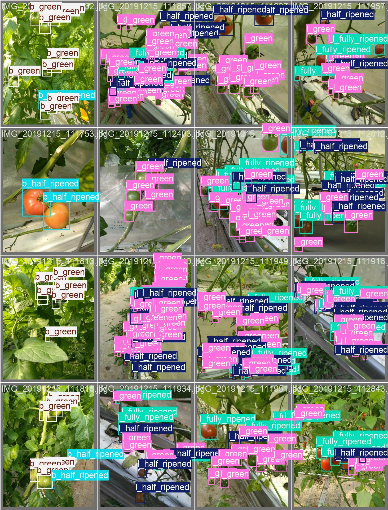

# 🍅 LaboroTomatoYoloV8 🍅 

Who doesn't like a tomato? See how the [LaboroTomato](https://github.com/laboroai/LaboroTomato) dataset can be trained and exported to onnx using [Ultralytics YOLOv8](https://github.com/autogyro/yolo-V8).

## Building the Docker image

Clone this repo and build the Dockerfile inside to get started.

```bash
git clone https://github.com/DavidAtRedpine/LaboroTomatoYoloV8.git && cd LaboroTomatoYoloV8
docker build -t laborotomatoyolov8:latest .
```

## Opening the Docker container

I like to do everything from inside the Docker container, mapping the training output  (`runs`) folder to host `e:\Docker\mount` so I can easily see the training results.

```bash
# Opens Docker container with 8GB of RAM (needed for training)
docker run --gpus all -it --shm-size=8g -v /e/Docker/mount:/app/yolov8/runs laborotomatoyolov8:latest /bin/bash
```

## Usage

From inside the container, you can use any of the Yolo operations on the tomato datasets.

### Train the model

```bash
# outputs model and training results to /app/yolov8/runs
yolo train model=yolov8s.pt data=/app/yolov8/data.yaml epochs=50 batch=16 imgsz=640 device=0
```

When the training is complete, you should be able to navigate to the `runs` folder to see the resulting model and data on how the training performed.

<div style="text-align: center;">
    
</div>

### Export to onnx

Once the training succeeds, you can export the model to onnx like so. I use this model for my Unity project.

```bash
# Creates an onnx file at /app/yolov8/runs/detect/train/weights/best.onnx
yolo export model=/app/yolov8/runs/detect/train/weights/best.pt format=onnx imgsz=640 dynamic=False half=True
```

## Other notes

As part of the Docker build, the `get_tomato_dataset.py` script gets the Tomato dataset from `http://assets.laboro.ai.s3.amazonaws.com/laborotomato/laboro_tomato.zip`. You may need to change the path should it change in the future. Consult the LaboroTomato [README](https://github.com/laboroai/LaboroTomato/blob/master/README.md) file for the correct path.


## License

Ultralytics YOLOv8 uses the GPLv3 license. Details [here](https://github.com/autogyro/yolo-V8?tab=readme-ov-file#license).

The LaboroTomato dataset uses the Creative Commons Attribution-NonCommercial-ShareAlike 4.0 International License. Details [here](https://github.com/laboroai/LaboroTomato/blob/master/README.md#license).

By using this repository, you agree to comply with the terms of both licenses.
